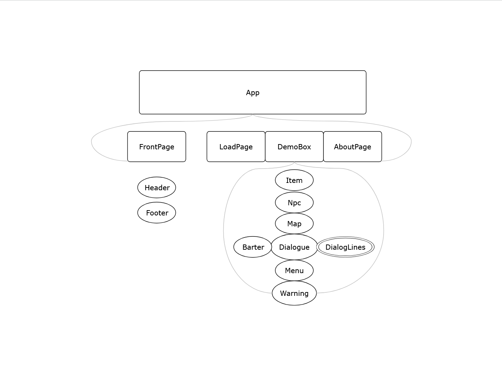

RPG Demo Box is a browser-based video game developed to test my skills in player customization, inventory management, branching dialogue, map exploration, and progression saving. I hope this short demonstration proves to be entertaining for anyone who gives it a go!

This app was developed using Vite + React with a MySQL Server integrated. In its current state, the app will not work on computers without direct access to my server. This will need to be patched in future updates.

https://docs.google.com/presentation/d/1olnhaBU4qOHSf9Cu1OGqw1VmE0fFsE-tGIV_kSW8CDg/edit?usp=sharing